<div align="center">

# ClearSugar

**A self-hosted diabetes intelligence dashboard for families managing Type 1 Diabetes.**

Real-time CGM monitoring · glucose prediction · smart alerts · AI-powered pattern insights —
running entirely on hardware you control, with your data going nowhere you didn't send it.

[](LICENSE)
[](https://nextjs.org)
[](docs/install/INSTALL.md)

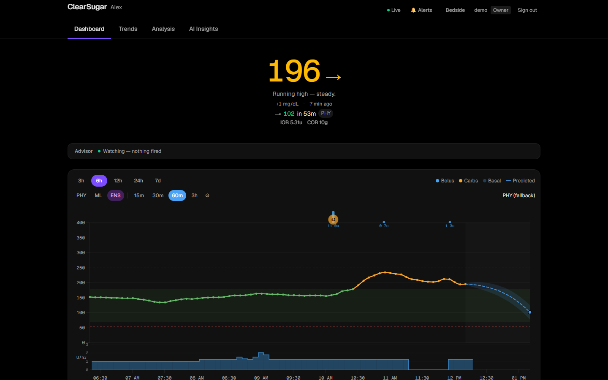

*Screenshots show real Type 1 diabetes data shared by the maintainer's family, anonymized
(the profile name is replaced). A built-in demo mode generates synthetic data so you can
explore the full app before connecting anything real.*

</div>

---

## Why ClearSugar?

Commercial diabetes apps show you *what* your glucose is. ClearSugar tries to answer the
questions that actually keep caregivers up at night:

- **"Where is this heading?"** — Physiological + optional ML glucose prediction, up to 3 hours out.
- **"Is something wrong with the site?"** — Automatic detection of failing infusion sites,
  ineffective corrections, and loop gaps.
- **"What should we change?"** — AI-generated weekly reports that read your patterns like a
  diabetes educator: basal adequacy by time block, carb-ratio validation, meal-response
  analysis, discussion points for your next endo visit.
- **"Is my kid okay right now?"** — A glanceable dashboard designed to answer that in
  under a second, plus a smart advisor that pushes alerts only when they're actionable.

It was built by a family living with T1D, for daily use — then sanitized and generalized
so any family can run it.

## What ClearSugar analyzes

Every image below is the actual app rendering real (anonymized) T1D data — not mockups.

### Live dashboard & prediction

The dashboard (hero image above) answers "is everything okay right now?" in a glance:
current glucose with trend and delta, a plain-language status line, and a **prediction
fan** up to 3 hours out — a physiological model (insulin activity curves, carb
absorption, Control-IQ awareness) that works out of the box, optionally blended with an
ML ensemble trained on your own data. Below it: the advisor status strip, a combined
glucose/bolus/carb/basal chart, IOB/COB, pump status, and a filterable data log.

### Ambulatory Glucose Profile (AGP)

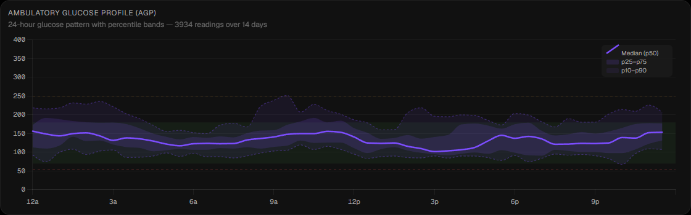

The standard clinical view of glucose variability: your 24-hour pattern as a median line
with p25–75 and p10–90 percentile bands. The same report your endocrinologist looks at,
computed over any 7/14/30/90-day window — so you walk into the appointment already
knowing what it shows.

### Daily overlay

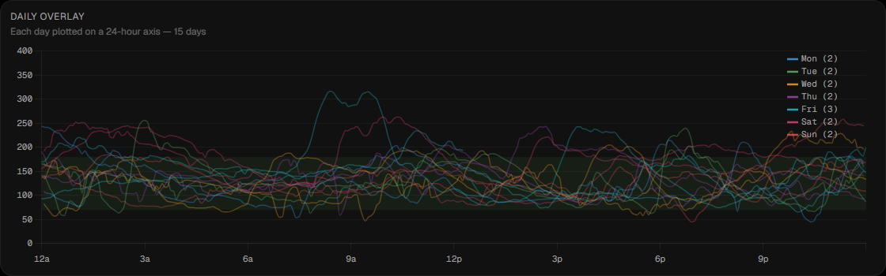

Every day in the window traced on a shared 24-hour axis. Where the AGP smooths, the
overlay exposes: one bad night stands out immediately instead of hiding in an average.

### Time-of-day & day-of-week patterns

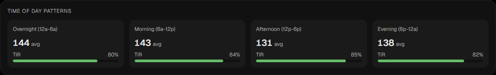
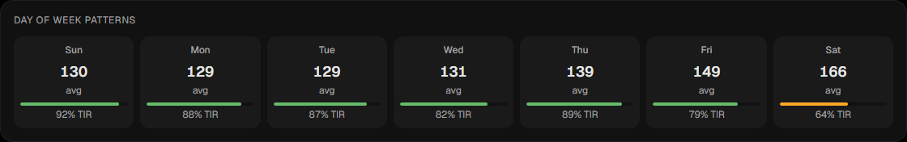

Mean glucose and time-in-range broken out by daypart and by weekday — the fastest way to
spot "afternoons are the problem" or "weekends run high."

### Meal response

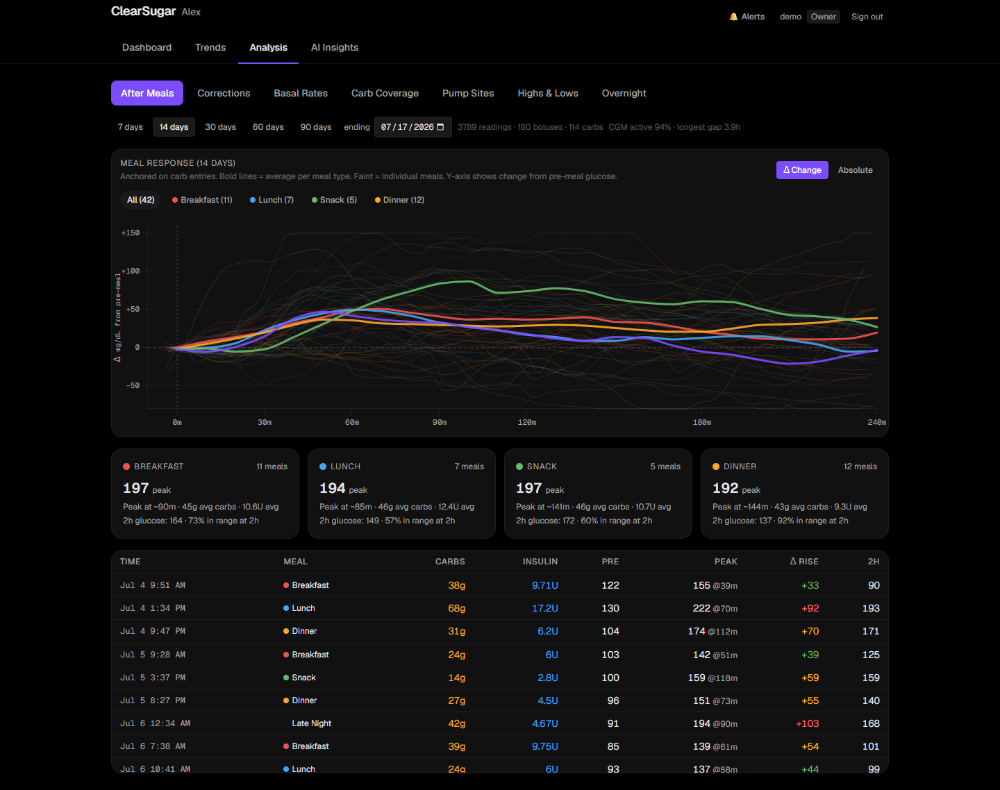

Post-meal glucose trajectories anchored on real carb entries, out to +4 hours: bold
averages per meal type (breakfast/lunch/snack/dinner) over the faint individual meals,
shown as change-from-pre-meal or absolute. Per-meal stats (peak, time-to-peak, 2-hour
outcome) and a sortable meal log answer "which meal is actually breaking the day?"

### Correction effectiveness

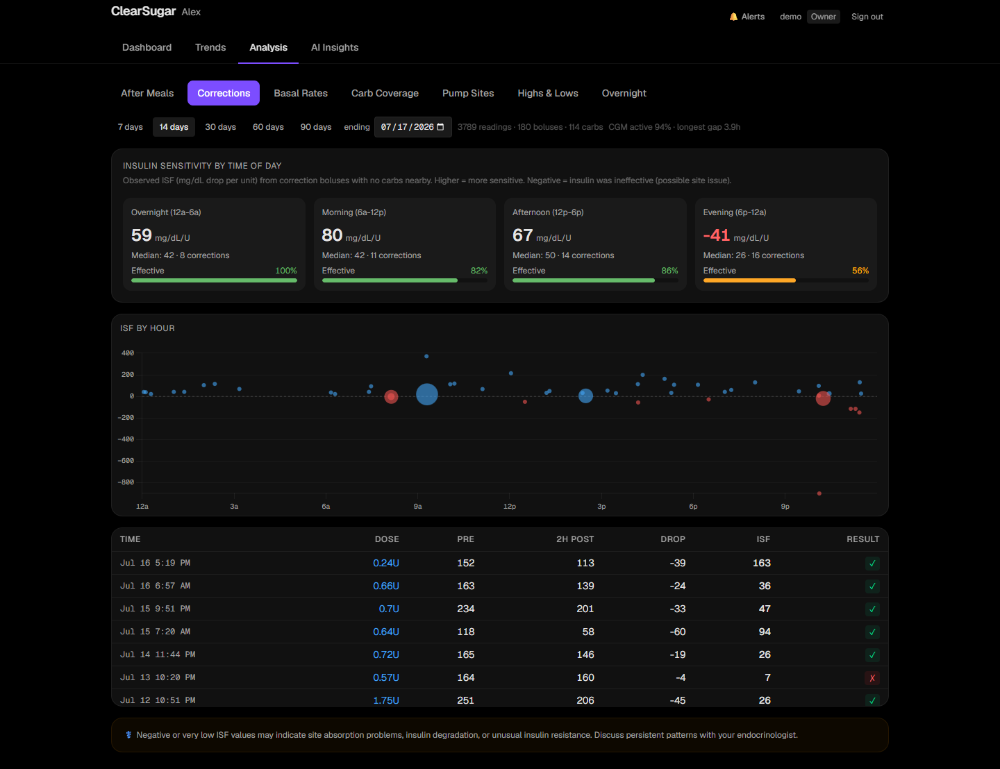

How far correction boluses *actually* move glucose, and the implied insulin sensitivity
factor by time of day — so you can see whether the pump's programmed ISF still matches
reality before your endo asks.

### Basal adequacy

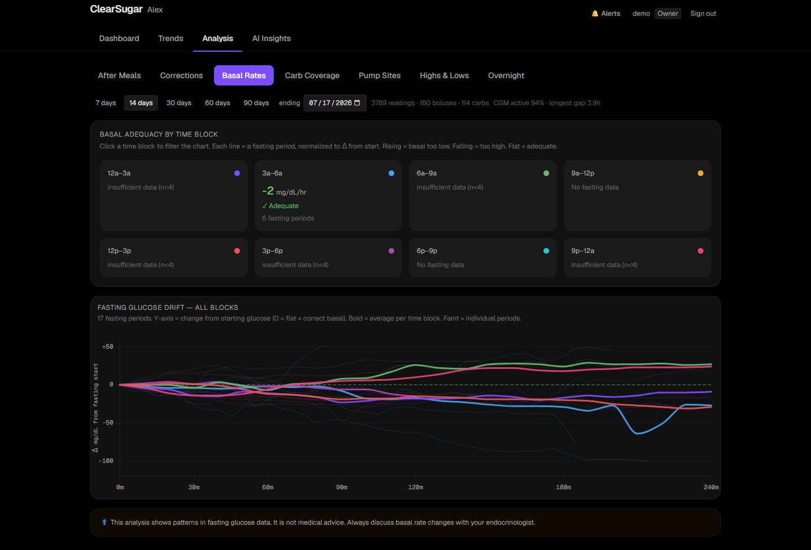

Fasting-window glucose drift by time block: when no food or bolus is on board, a flat
line means basal is right, and a consistent rise or fall points at the specific block
that needs attention.

### Carb coverage

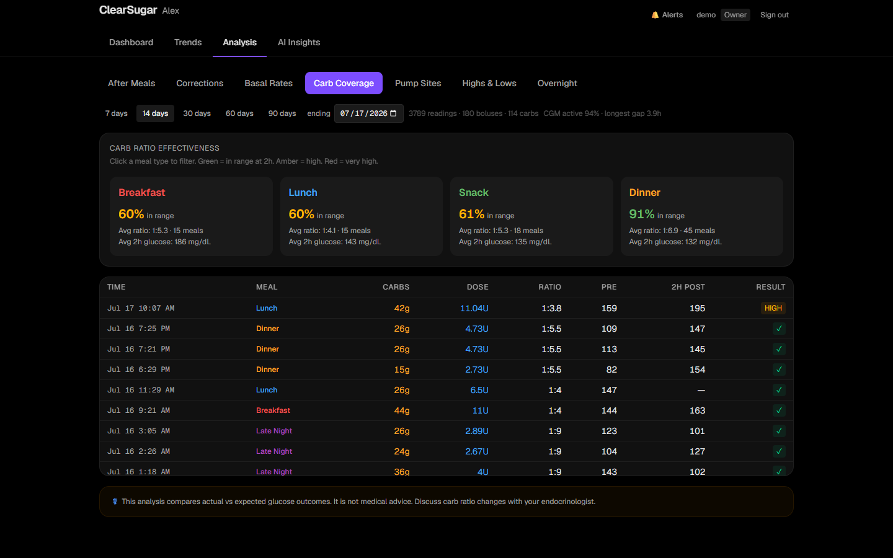

Observed carb-ratio outcomes versus what the pump is programmed with, by meal — evidence
for the "should we change the breakfast ratio?" conversation.

### Pump-site aging

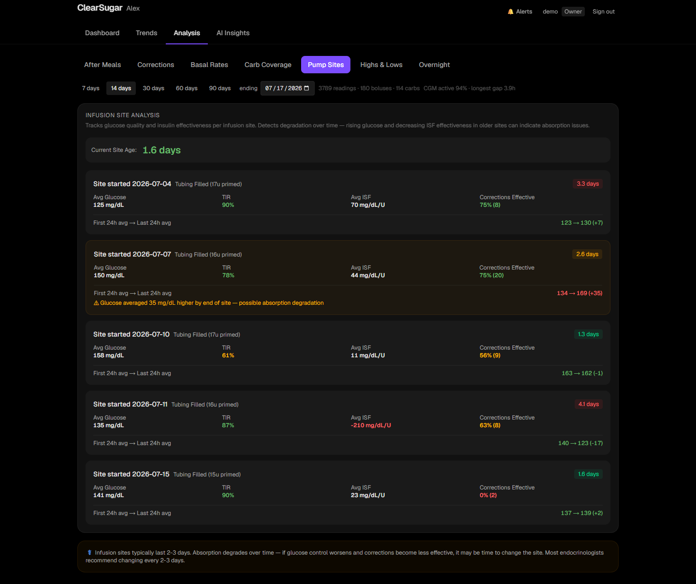

Splits history at each infusion-site change and compares performance across the site's
life — catching absorption decay on day 3 instead of discovering it as an unexplained
stubborn high.

### Highs & lows forensics

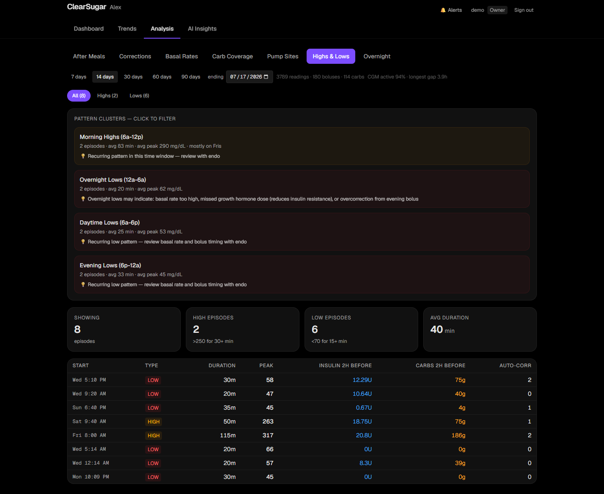

Out-of-range episodes clustered into discrete events with their context — when they
started, how long they lasted, what insulin/carbs surrounded them — instead of a wall of
red dots.

### Overnight & hormone patterns

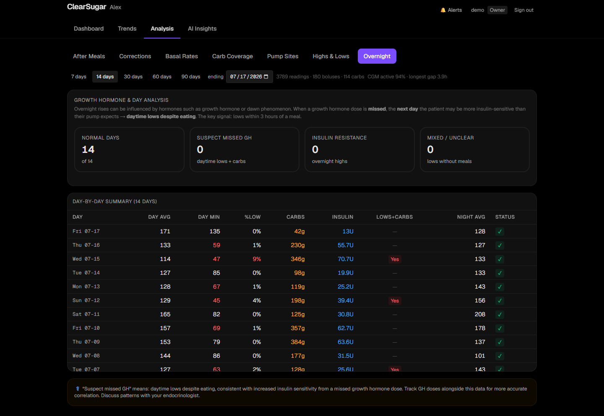

Classifies each day's pattern (normal / suspect missed hormone dose with next-day lows /
overnight insulin resistance / mixed) with the reasoning shown. Built for regimens where
an evening medication — growth hormone, in the family this was built for — changes the
next day's insulin sensitivity; gated by the patient profile so it only appears when
relevant.

### AI insights (optional)

A narrative weekly report written by the AI provider you configure, grounded in the same
computed statistics above (never raw guesswork): what changed versus the prior period,
which time blocks drifted, discussion points for your next clinic visit. Plus a
pattern-detection feed (profile changes, site/sensor issues) and an "ask your data" chat.
Works with Anthropic, local models via Ollama or any OpenAI-compatible server, or not at
all — every chart above works without it.

## Features

- **Live dashboard** — current glucose, trend, delta, prediction band, insulin-on-board,
  pump status, and a combined glucose/bolus/carb/basal chart (3h–7d windows).
- **Glucose prediction** — a physiological model (insulin activity, carb absorption,
  Control-IQ behavior) that works out of the box, optionally blended with a
  LightGBM/ONNX ML ensemble you can train on your own data.
- **Smart advisor & alerts** — rule-based detection (urgent lows, sustained highs,
  site failure, rescue-carb patterns, loop gaps) with configurable thresholds and
  quiet behavior when nothing is wrong.
- **Trends** — 14/30/90-day AGP with percentile bands, day-of-week patterns, daily overlays.
- **Analysis** — meal-response curves anchored on real carb entries, correction
  effectiveness, basal-rate evaluation, pump-site aging, highs/lows forensics, overnight patterns.
- **AI insights (optional)** — narrative weekly reports and an "ask your data" chat,
  powered by the AI provider *you* choose (see below). Prompts are grounded in your
  configured patient profile, and your data never leaves the providers you configure.
- **Demo mode** — set `DEMO_MODE=true` and explore the full app on realistic synthetic
  data before connecting anything real.
- **Multi-user with roles** — owner / parent / child / viewer permission levels.
- **iOS companion app** — iPhone + Apple Watch app in [`ios/`](ios/): home/lock-screen
  widgets, watch complications, Live Activity, and glucose alerts. Build it yourself
  with Xcode against your own server — see below.

## How data flows

ClearSugar reads everything from **[Nightscout](https://nightscout.github.io/)**, the
open-source CGM platform — that's the only hard dependency, and the setup wizard can
generate a Docker Compose stack for it if you don't already run one.


- **Dexcom** data arrives via Nightscout's built-in `bridge` plugin (Dexcom Share
  credentials) or any Nightscout-compatible uploader.
- **Tandem pump** data (basal, boluses, Control-IQ modes, IOB) arrives via
  [tconnectsync](https://github.com/jwoglom/tconnectsync).
- Other CGMs/pumps work too — anything that can feed Nightscout feeds ClearSugar.

## Quick start

```bash
git clone <this-repo>
cd clearsugar-community
npm install
npm run setup     # guided wizard — see below
npm run build
npm start         # http://localhost:3000
```

The **setup wizard** walks you through everything and writes your `.env` and initial data:

1. Medical-safety acknowledgment
2. Nightscout — connect an existing site, or generate a Docker Compose stack
   (Nightscout + MongoDB, with optional Dexcom Share bridge and tconnectsync)
3. Patient profile (name, CGM, pump, optional clinical notes — used to personalize
   the UI and AI prompts; stays on your disk)
4. Admin account (username/password, bcrypt-hashed)
5. AI provider (optional): **Anthropic API**, **Claude Code CLI**, **Codex CLI**,
   **Ollama**, or **any OpenAI-compatible server** (LM Studio, llama.cpp, vLLM,
   OpenRouter…) — or none. The wizard can detect/install the CLIs with your permission.
6. Remote access: LAN-only, **Tailscale** (recommended if you don't own a domain —
   automatic HTTPS, zero open ports, works great for family phones), or your own
   reverse proxy + domain.
7. iOS companion app (optional): writes `ios/Config/Server.xcconfig` with your server
   URL and bundle identifier, ready for an Xcode build on your Mac.

Just exploring? Skip the wizard:

```bash
DEMO_MODE=true AUTH_SECRET=$(openssl rand -base64 32) npm run dev
```

Full instructions, systemd units, updating, and remote-access details:
**[docs/install/INSTALL.md](docs/install/INSTALL.md)**.

## Choosing an AI provider

The AI insights feature is optional and provider-agnostic:

| Provider | Good for | Data leaves your network? |
|---|---|---|
| Anthropic API | Best report quality, no local hardware | To Anthropic only |
| Claude Code CLI | You already have a Claude subscription | To Anthropic only |
| Codex CLI | You already have a ChatGPT subscription | To OpenAI only |
| Ollama | Full privacy, free, needs a decent GPU | Never |
| OpenAI-compatible | LM Studio, vLLM, OpenRouter, anything | Depends on the server |
| None | Everything except the Insights page works | Never |

## iOS companion app

The [`ios/`](ios/) directory contains a native iPhone + Apple Watch companion app:

- **Glanceable everywhere** — home-screen and lock-screen widgets, watch complications,
  and a Live Activity with the current glucose, trend, and prediction on the Lock
  Screen / Dynamic Island.
- **Alerts on your wrist** — urgent low/high, stale-data, and pump alerts with snooze
  actions and configurable thresholds synced to the server.
- **Yours end to end** — you build it in Xcode against **your** server; there is no App
  Store listing, no third-party service, and no telemetry.

Requirements: an iPhone (iOS 17+), a Mac with Xcode 16+, and a free or paid Apple
Developer account (a paid account is only needed for APNs push — polling, widgets, and
alerts work on a free account). The setup wizard (step 7) writes the app's server
configuration for you; then on the Mac: `brew install xcodegen`, `cd ios && xcodegen
generate`, open the project, set your signing team, and build.

Full walkthrough: **[ios/README.md](ios/README.md)**.

## Security model

- **Everything requires auth.** Web sessions (username/password, bcrypt cost 12,
  login rate-limiting), API keys for machine clients, short-lived JWTs for mobile.
- **Secrets stay local** in a git-ignored `.env` generated by the wizard.
- **No telemetry, no accounts, no cloud.** The app talks to your Nightscout, your
  optional ML service, and the AI provider you chose. Nothing else.
- **HTTPS before exposure** — use Tailscale (easiest) or a reverse proxy with a real
  certificate before accessing off-LAN. See [SECURITY.md](SECURITY.md).

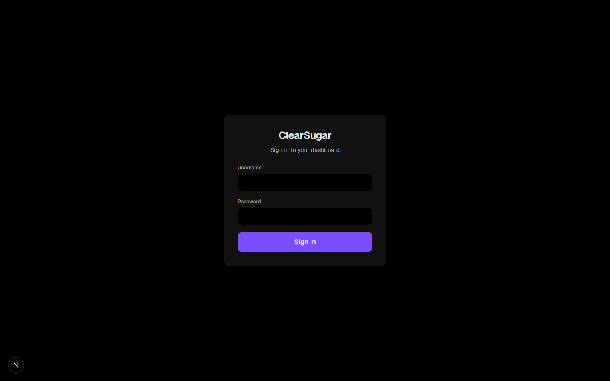

## Roadmap

- Multi-patient support (the data model is currently single-patient per install).
- Web-push alerts for Android/desktop browsers.
- Configurable timezone for the analysis/ML pipeline (currently assumes US Eastern).

## ⚠️ Medical disclaimer

ClearSugar is **not a medical device** and is not FDA-cleared/CE-marked. It is a
data-visualization and decision-support tool for personal, non-commercial use.

- **Never** rely on it as your only alerting system. Keep your CGM manufacturer's app
  and alarms active at all times.
- Predictions and AI-generated insights can be wrong. Always verify with your meter/CGM
  and consult your care team before changing any therapy settings.

## Contributing & license

Contributions welcome — see [AGENTS.md](AGENTS.md) for developer notes and configuration
contracts. Licensed under [AGPL-3.0](LICENSE): run it, fork it, improve it, but keep
derivatives open.

Standing on the shoulders of: [Nightscout](https://github.com/nightscout/cgm-remote-monitor),
[tconnectsync](https://github.com/jwoglom/tconnectsync), and the #WeAreNotWaiting community.
