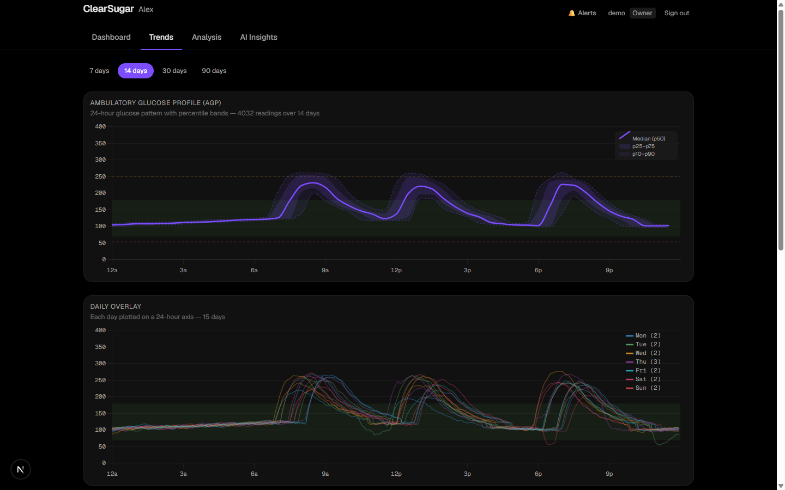
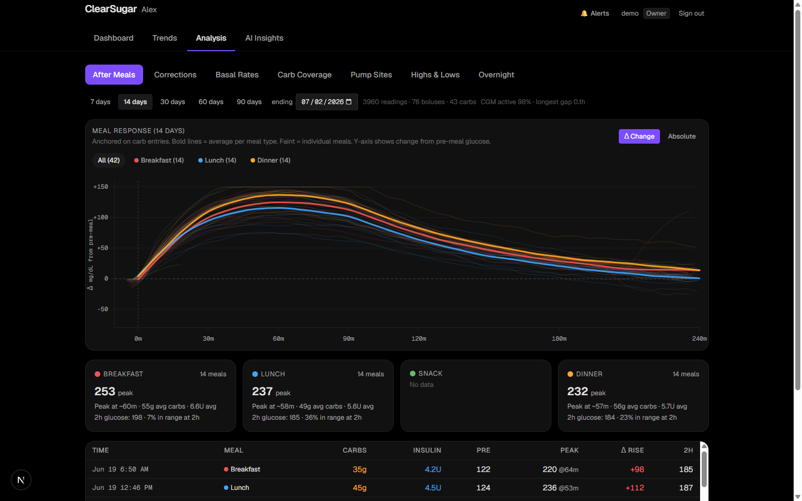
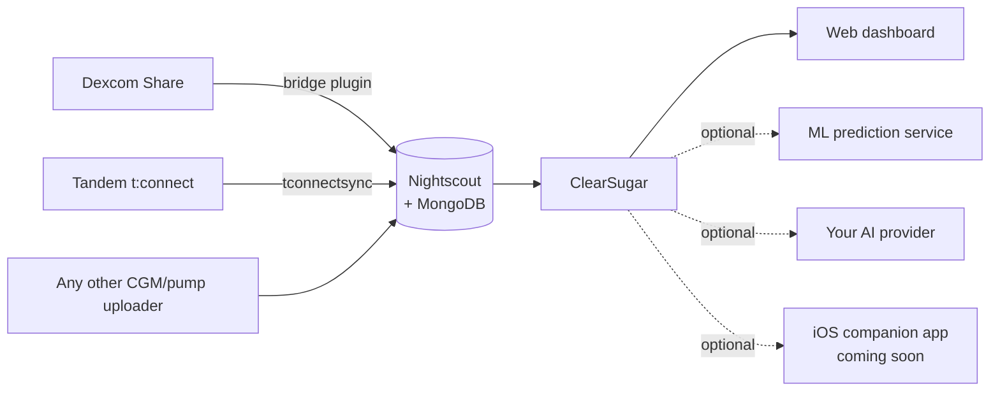

<div align="center">

# ClearSugar

**A self-hosted diabetes intelligence dashboard for families managing Type 1 Diabetes.**

Real-time CGM monitoring · glucose prediction · smart alerts · AI-powered pattern insights —
running entirely on hardware you control, with your data going nowhere you didn't send it.

[](LICENSE)
[](https://nextjs.org)
[](docs/install/INSTALL.md)


*All screenshots show synthetic demo data generated by the built-in demo mode.*

</div>

---

## Why ClearSugar?

Commercial diabetes apps show you *what* your glucose is. ClearSugar tries to answer the
questions that actually keep caregivers up at night:

- **"Where is this heading?"** — Physiological + optional ML glucose prediction, up to 3 hours out.
- **"Is something wrong with the site?"** — Automatic detection of failing infusion sites,
  ineffective corrections, and loop gaps.
- **"What should we change?"** — AI-generated weekly reports that read your patterns like a
  diabetes educator: basal adequacy by time block, carb-ratio validation, meal-response
  analysis, discussion points for your next endo visit.
- **"Is my kid okay right now?"** — A glanceable dashboard designed to answer that in
  under a second, plus a smart advisor that pushes alerts only when they're actionable.

It was built by a family living with T1D, for daily use — then sanitized and generalized
so any family can run it.

## Screenshots

| Trends — AGP & daily overlay | Analysis — meal response |
|---|---|
|  |  |

| Simple sign-in | |
|---|---|
|  | Every page requires login. Username/password with bcrypt — no OAuth provider to stand up. |

## Features

- **Live dashboard** — current glucose, trend, delta, prediction band, insulin-on-board,
  pump status, and a combined glucose/bolus/carb/basal chart (3h–7d windows).
- **Glucose prediction** — a physiological model (insulin activity, carb absorption,
  Control-IQ behavior) that works out of the box, optionally blended with a
  LightGBM/ONNX ML ensemble you can train on your own data.
- **Smart advisor & alerts** — rule-based detection (urgent lows, sustained highs,
  site failure, rescue-carb patterns, loop gaps) with configurable thresholds and
  quiet behavior when nothing is wrong.
- **Trends** — 14/30/90-day AGP with percentile bands, day-of-week patterns, daily overlays.
- **Analysis** — meal-response curves anchored on real carb entries, correction
  effectiveness, basal-rate evaluation, pump-site aging, highs/lows forensics, overnight patterns.
- **AI insights (optional)** — narrative weekly reports and an "ask your data" chat,
  powered by the AI provider *you* choose (see below). Prompts are grounded in your
  configured patient profile, and your data never leaves the providers you configure.
- **Demo mode** — set `DEMO_MODE=true` and explore the full app on realistic synthetic
  data before connecting anything real.
- **Multi-user with roles** — owner / parent / child / viewer permission levels.

## How data flows

ClearSugar reads everything from **[Nightscout](https://nightscout.github.io/)**, the
open-source CGM platform — that's the only hard dependency, and the setup wizard can
generate a Docker Compose stack for it if you don't already run one.



- **Dexcom** data arrives via Nightscout's built-in `bridge` plugin (Dexcom Share
  credentials) or any Nightscout-compatible uploader.
- **Tandem pump** data (basal, boluses, Control-IQ modes, IOB) arrives via
  [tconnectsync](https://github.com/jwoglom/tconnectsync).
- Other CGMs/pumps work too — anything that can feed Nightscout feeds ClearSugar.

## Quick start

```bash
git clone <this-repo>
cd clearsugar-community
npm install
npm run setup     # guided wizard — see below
npm run build
npm start         # http://localhost:3000
```

The **setup wizard** walks you through everything and writes your `.env` and initial data:

1. Medical-safety acknowledgment
2. Nightscout — connect an existing site, or generate a Docker Compose stack
   (Nightscout + MongoDB, with optional Dexcom Share bridge and tconnectsync)
3. Patient profile (name, CGM, pump, optional clinical notes — used to personalize
   the UI and AI prompts; stays on your disk)
4. Admin account (username/password, bcrypt-hashed)
5. AI provider (optional): **Anthropic API**, **Claude Code CLI**, **Codex CLI**,
   **Ollama**, or **any OpenAI-compatible server** (LM Studio, llama.cpp, vLLM,
   OpenRouter…) — or none. The wizard can detect/install the CLIs with your permission.
6. Remote access: LAN-only, **Tailscale** (recommended if you don't own a domain —
   automatic HTTPS, zero open ports, works great for family phones), or your own
   reverse proxy + domain.

Just exploring? Skip the wizard:

```bash
DEMO_MODE=true AUTH_SECRET=$(openssl rand -base64 32) npm run dev
```

Full instructions, systemd units, updating, and remote-access details:
**[docs/install/INSTALL.md](docs/install/INSTALL.md)**.

## Choosing an AI provider

The AI insights feature is optional and provider-agnostic:

| Provider | Good for | Data leaves your network? |
|---|---|---|
| Anthropic API | Best report quality, no local hardware | To Anthropic only |
| Claude Code CLI | You already have a Claude subscription | To Anthropic only |
| Codex CLI | You already have a ChatGPT subscription | To OpenAI only |
| Ollama | Full privacy, free, needs a decent GPU | Never |
| OpenAI-compatible | LM Studio, vLLM, OpenRouter, anything | Depends on the server |
| None | Everything except the Insights page works | Never |

## Security model

- **Everything requires auth.** Web sessions (username/password, bcrypt cost 12,
  login rate-limiting), API keys for machine clients, short-lived JWTs for mobile.
- **Secrets stay local** in a git-ignored `.env` generated by the wizard.
- **No telemetry, no accounts, no cloud.** The app talks to your Nightscout, your
  optional ML service, and the AI provider you chose. Nothing else.
- **HTTPS before exposure** — use Tailscale (easiest) or a reverse proxy with a real
  certificate before accessing off-LAN. See [SECURITY.md](SECURITY.md).

## Roadmap

- **iOS companion app** — glanceable widgets, Live Activities, and push alerts via APNs.
  The server side (device registration, JWT auth, Live Activity push) already ships in
  this repo; the app itself is being prepared for release as a separate repository.
- Multi-patient support (the data model is currently single-patient per install).
- Web-push alerts for Android/desktop browsers.
- Configurable timezone for the analysis/ML pipeline (currently assumes US Eastern).

## ⚠️ Medical disclaimer

ClearSugar is **not a medical device** and is not FDA-cleared/CE-marked. It is a
data-visualization and decision-support tool for personal, non-commercial use.

- **Never** rely on it as your only alerting system. Keep your CGM manufacturer's app
  and alarms active at all times.
- Predictions and AI-generated insights can be wrong. Always verify with your meter/CGM
  and consult your care team before changing any therapy settings.

## Contributing & license

Contributions welcome — see [AGENTS.md](AGENTS.md) for developer notes and configuration
contracts. Licensed under [AGPL-3.0](LICENSE): run it, fork it, improve it, but keep
derivatives open.

Standing on the shoulders of: [Nightscout](https://github.com/nightscout/cgm-remote-monitor),
[tconnectsync](https://github.com/jwoglom/tconnectsync), and the #WeAreNotWaiting community.
